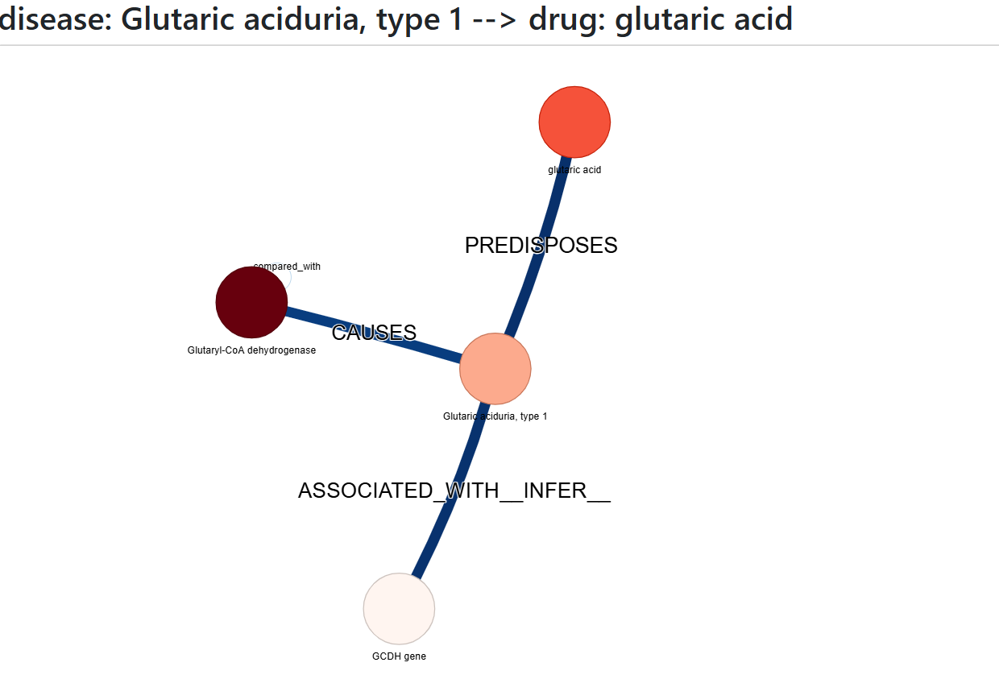
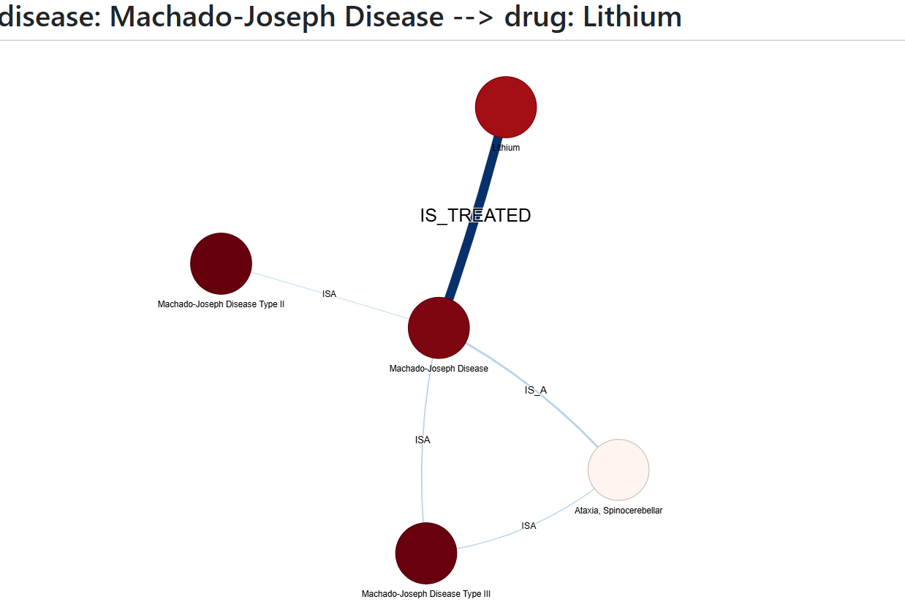

# Explainable Link Prediction (Drug-Disease Interaction) on Biomedical Knowledge Graphs using GNNs
This repository contains the code and results for the MSc thesis titled "Explainable link prediction (drug–disease interaction) on Biomedical Knowledge Graphs with the use of Graph Neural Networks" by Sofia Sykallou, submitted to the University of the Peloponnese & NCSR “Democritos” MSc Programme in Data Science.
The focuses on predicting potential drug-disease interactions for drug repurposing using Graph Neural Networks (GNNs) applied to a biomedical knowledge graph. 
The goal is to make these predictions interpretable using Explainable AI (XAI) techniques. 
The pipeline involves training a GCN for link prediction and then employing GNNExplainer to understand the factors driving the model's predictions.

  
  

## Data
* **Knowledge Graph:** The experiments utilize the iASiS Open Data Graph.
* **Input Format:** The graph data was initially provided in Tab-Separated Values (TSV) format.
* **Focus Diseases:** The study focused on identifying potential drug interactions for a specific set of rare diseases.

## Methodology
1.  **Graph Preprocessing:** The raw TSV data was processed, encoding nodes (drugs, diseases, articles, etc.) and relations into numerical IDs suitable for GNNs. Learnable embeddings were used for node features.
2.  **Link Prediction Model:** A two-layer GCN, implemented using PyTorch Geometric, was trained to predict the likelihood of links between drug and disease nodes. The model was trained using positive examples from the graph and negatively sampled non-existent links.
3.  **Explanation Method:** GNNExplainer was used to generate post-hoc explanations for the GCN's predictions. It identifies the most influential subgraph structures and node features contributing to each predicted drug-disease link.

## Code
* The implementation is provided in the Python script:
    `allpredictions_link_prediction_gcn_gnnexplainer_full_graph.ipynb`

## Results and Visualizations
* The GCN model achieved strong predictive performance on the link prediction task (Test AUC: 0.9604).
* 44 potential novel drug-disease interactions were identified in the test set.
* This repository includes generated visualizations for each prediction:
    * **Feature Importance Plots:** Bar charts showing the top 10 most influential nodes for each prediction.
    * **Interactive Explanation Subgraphs:** HTML files generated using PyVis showing the local graph structure highlighted by GNNExplainer.
* Predictions were categorized as "Strong" or "Weak" based on the clarity of the GNNExplainer output. Many "Weak" predictions corresponded to links already present in the input data.

## License
This project is licensed under the MIT License - see the [LICENSE](LICENSE) file for details.
